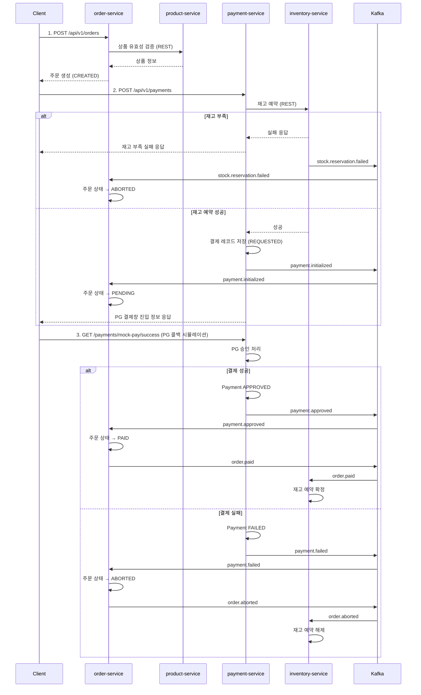
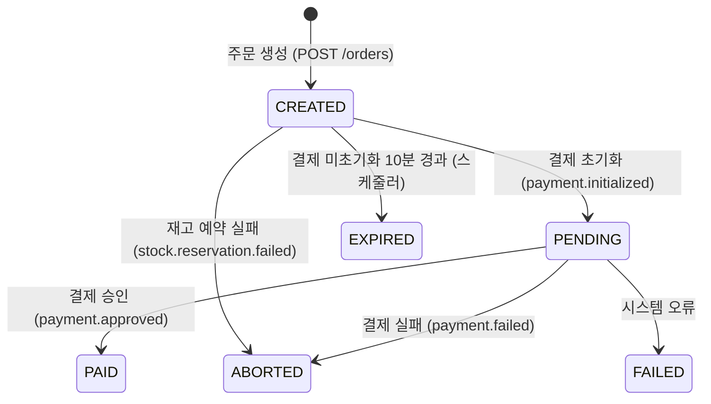
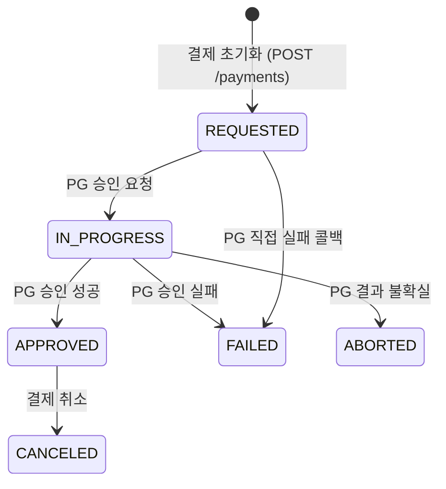

# Commerce MSA

- 상품 조회부터 결제 완료까지의 주문 플로우를 여러 독립 서비스가 협력해 처리하는 이벤트 기반 커머스 MSA 시스템
- Kafka 기반 이벤트 흐름, 재고 예약, 결제 승인, 멱등 처리 등 실제 커머스 환경의 문제를 직접 구현하며 검증하는 프로젝트

---

## 기술 스택

- **Language** Java 21
- **Framework** Spring Boot 3.5, Spring Cloud Stream
- **Build** Gradle (Kotlin DSL, Multi-module)
- **Database** PostgreSQL 16 (서비스별 스키마 분리)
- **Messaging** Apache Kafka (KRaft)
- **Persistence** Spring Data JPA, QueryDSL
- **API Docs** Springdoc OpenAPI (Swagger UI)

---

## 서비스 구성

| Service           | Port  | 역할                 |
|-------------------|-------|--------------------|
| product-service   | 20101 | 상품 등록 / 조회 / 상태 관리 |
| inventory-service | 20102 | 재고 등록 / 수량 관리      |
| order-service     | 20103 | 주문 생성 / 상태 추적      |
| payment-service   | 20104 | 결제 초기화 / 승인 처리     |

공유 라이브러리 `shared/common`은 예외 계층, 이벤트 유틸리티, 웹 에러 처리를 Spring Boot Auto-configuration으로 제공

---

## 주문 흐름

- 결제 초기화 시점에 재고를 동기 예약하여 결제창 진입 전 재고 확보를 보장
- 재고 확정·해제 등 사후 처리는 Kafka 이벤트로 비동기 협력



### 주문 상태 전이



### 결제 상태 전이



---

## 아키텍처

### DDD 레이어 구조

각 서비스는 동일한 패키지 구조를 따름.

```
dev.labs.commerce.{service}
├─ api/ # HTTP 계층 (Controller, Request/Response DTO)
├─ core/
│ └─ {domain}/
│ ├─ application/ # UseCase (트랜잭션 경계), CommandService, QueryService
│ ├─ domain/ # 모델, 도메인 예외, 이벤트, Repository 인터페이스
│ └─ infra/ # Kafka Publisher/Consumer, QueryDSL
├─ config/ # Spring 빈 설정
└─ *Application
```

**레이어 간 의존성 규칙:**

- `api` → `application`만 호출 (Repository, Kafka 직접 접근 금지)
- `domain` → Spring/Infra 의존 없음 (순수 비즈니스 로직)
- `application` → `domain` 인터페이스만 사용
- `infra` → `domain` 계약만 참조 (api/application 참조 금지)

### Kafka 토픽

| Topic                      | Publisher         | Subscriber        |
|----------------------------|-------------------|-------------------|
| `order.aborted`            | order-service     | inventory-service |
| `order.expired`            | order-service     | inventory-service |
| `order.paid`               | order-service     | inventory-service |
| `product.registered`       | product-service   | inventory-service |
| `stock.reservation.failed` | inventory-service | order-service     |
| `payment.initialized`      | payment-service   | order-service     |
| `payment.approved`         | payment-service   | order-service     |
| `payment.failed`           | payment-service   | order-service     |

### 주문 만료 스케줄러

결제 초기화 과정에서 장애가 발생하면 주문이 `PENDING` 상태로 방치될 수 있다. 이를 처리하기 위해 order-service에 만료 스케줄러를 구현했다.

- 1분 주기로 실행되며, `CREATED` 상태인 주문 중 생성 시각 기준 10분을 초과한 것을 만료 대상으로 조회
- 대상 주문을 `EXPIRED`로 상태 전이하고 `order.expired` 이벤트 발행
- inventory-service는 이벤트를 수신해 해당 주문의 재고 예약을 해제하며, 예약이 없는 경우 멱등하게 skip 처리

만료 기준 시간은 `order.expiry.pending-expiry-minutes`(기본값 10분)로 조정 가능하다.

### Mock PG 게이트웨이

실제 PG사 연동 없이 개발/테스트 가능하도록 `PgGateway` 인터페이스와 `MockPgGateway` 구현체를 제공.
`PgGatewayRouter`가 결제 요청의 `PgProvider` 값 기반으로 구현체를 라우팅하므로, 실제 PG 구현체 추가 시 기존 코드 변경 없음.

결제 초기화 시 `idempotencyKey` 중복 여부를 사전 검사해, 네트워크 재시도로 동일 요청이 재전송되어도 이중 결제 미발생.

---

## 로컬 실행

### 사전 요구사항

- Java 21
- Docker & Docker Compose

### 1. 인프라 시작

```bash
cd deploy && docker compose up -d
```

| Service    | Host Port |
|------------|-----------|
| PostgreSQL | 20011     |
| Redis      | 20021     |
| Kafka      | 20023     |

### 2. 서비스 실행

각 서비스를 개별 터미널에서 실행.

```bash
./gradlew :service:product-service:bootRun
./gradlew :service:inventory-service:bootRun
./gradlew :service:order-service:bootRun
./gradlew :service:payment-service:bootRun
```

### 3. 시나리오 실행

`service/http/scenario.http`를 IntelliJ HTTP Client로 순서대로 실행.

| 단계 | 요청                                              | 서비스               |
|----|-------------------------------------------------|-------------------|
| 1  | 상품 등록 `POST /api/v1/products`                   | product-service   |
| 2  | 상품 활성화 `PATCH /api/v1/products/{id}/status`     | product-service   |
| 3  | 재고 적재 `PATCH /api/v1/inventories/{id}/quantity` | inventory-service |
| 4  | 주문 생성 `POST /api/v1/orders`                     | order-service     |
| 5  | 결제 초기화 `POST /api/v1/payments`                  | payment-service   |
| 6  | PG 콜백 시뮬레이션 `GET /payments/mock-pay/success`    | payment-service   |

### Docker Compose로 전체 실행 (인프라 + 서비스 일괄 기동)

인프라와 4개 서비스를 한 번에 빌드·실행한다.

```bash
docker compose -f docker-compose.app.yml up --build
```

백그라운드 실행:

```bash
docker compose -f docker-compose.app.yml up --build -d
```

종료 및 정리:

```bash
# 컨테이너 중지·제거
docker compose -f docker-compose.app.yml down

# 볼륨(DB 데이터)까지 삭제
docker compose -f docker-compose.app.yml down -v
```
