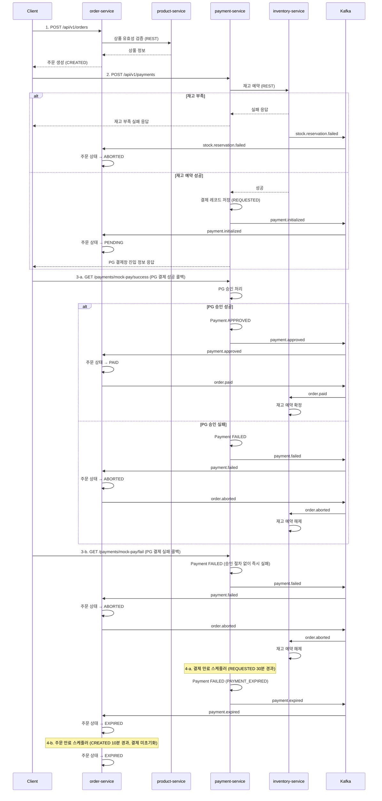
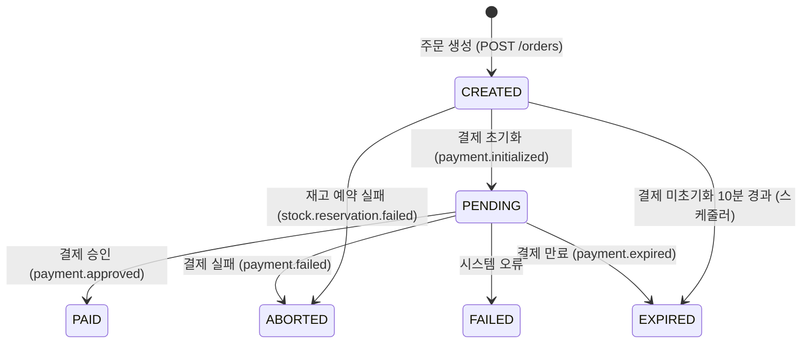
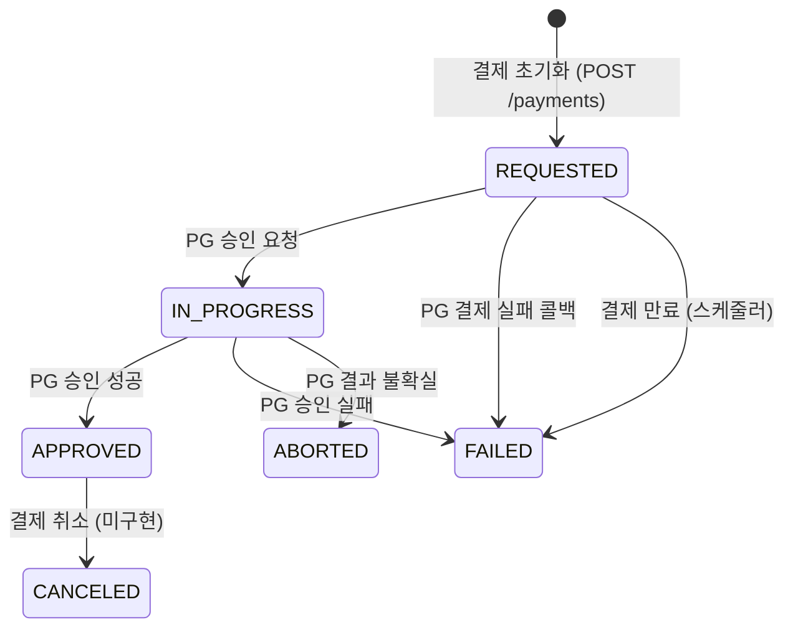

# 주문 흐름

- 결제 초기화 시점에 재고를 동기 예약하여 결제창 진입 전 재고 확보를 보장
- 재고 확정·해제 등 사후 처리는 Kafka 이벤트로 비동기 협력

```mermaid
sequenceDiagram
    participant C as Client
    participant OS as order-service
    participant PS as product-service
    participant PAY as payment-service
    participant IS as inventory-service
    participant K as Kafka
    C ->> OS: 1. POST /api/v1/orders
    OS ->> PS: 상품 유효성 검증 (REST)
    PS -->> OS: 상품 정보
    OS -->> C: 주문 생성 (CREATED)
    C ->> PAY: 2. POST /api/v1/payments
    PAY ->> IS: 재고 예약 (REST)
    alt 재고 부족
        IS -->> PAY: 실패 응답
        PAY -->> C: 재고 부족 실패 응답
        IS ->> K: stock.reservation.failed
        K ->> OS: stock.reservation.failed
        OS ->> OS: 주문 상태 → ABORTED
    else 재고 예약 성공
        IS -->> PAY: 성공
        PAY ->> PAY: 결제 레코드 저장 (REQUESTED)
        PAY ->> K: payment.initialized
        K ->> OS: payment.initialized
        OS ->> OS: 주문 상태 → PENDING
        PAY -->> C: PG 결제창 진입 정보 응답
    end

    C ->> PAY: 3-a. GET /payments/mock-pay/success (PG 결제 성공 콜백)
    PAY ->> PAY: PG 승인 처리
    alt PG 승인 성공
        PAY ->> PAY: Payment APPROVED
        PAY ->> K: payment.approved
        K ->> OS: payment.approved
        OS ->> OS: 주문 상태 → PAID
        OS ->> K: order.paid
        K ->> IS: order.paid
        IS ->> IS: 재고 예약 확정
    else PG 승인 실패
        PAY ->> PAY: Payment FAILED
        PAY ->> K: payment.failed
        K ->> OS: payment.failed
        OS ->> OS: 주문 상태 → ABORTED
        OS ->> K: order.aborted
        K ->> IS: order.aborted
        IS ->> IS: 재고 예약 해제
    end

    C ->> PAY: 3-b. GET /payments/mock-pay/fail (PG 결제 실패 콜백)
    PAY ->> PAY: Payment FAILED (승인 절차 없이 즉시 실패)
    PAY ->> K: payment.failed
    K ->> OS: payment.failed
    OS ->> OS: 주문 상태 → ABORTED
    OS ->> K: order.aborted
    K ->> IS: order.aborted
    IS ->> IS: 재고 예약 해제

    note over PAY: 4-a. 결제 만료 스케줄러 (REQUESTED 30분 경과)
    PAY ->> PAY: Payment FAILED (PAYMENT_EXPIRED)
    PAY ->> K: payment.expired
    K ->> OS: payment.expired
    OS ->> OS: 주문 상태 → EXPIRED

    note over OS: 4-b. 주문 만료 스케줄러 (CREATED 10분 경과, 결제 미초기화)
    OS ->> OS: 주문 상태 → EXPIRED
```

## 주문 상태 전이

```mermaid
stateDiagram-v2
    [*] --> CREATED: 주문 생성 (POST /orders)
    CREATED --> PENDING: 결제 초기화 (payment.initialized)
    CREATED --> ABORTED: 재고 예약 실패 (stock.reservation.failed)
    CREATED --> EXPIRED: 결제 미초기화 10분 경과 (스케줄러)
    PENDING --> PAID: 결제 승인 (payment.approved)
    PENDING --> ABORTED: 결제 실패 (payment.failed)
    PENDING --> EXPIRED: 결제 만료 (payment.expired)
    PENDING --> FAILED: 시스템 오류
```

## 결제 상태 전이

```mermaid
stateDiagram-v2
    [*] --> REQUESTED: 결제 초기화 (POST /payments)
    REQUESTED --> IN_PROGRESS: PG 승인 요청
    IN_PROGRESS --> APPROVED: PG 승인 성공
    IN_PROGRESS --> FAILED: PG 승인 실패
    IN_PROGRESS --> ABORTED: PG 결과 불확실
    REQUESTED --> FAILED: PG 결제 실패 콜백
    REQUESTED --> FAILED: 결제 만료 (스케줄러)
    APPROVED --> CANCELED: 결제 취소 (미구현)
```
