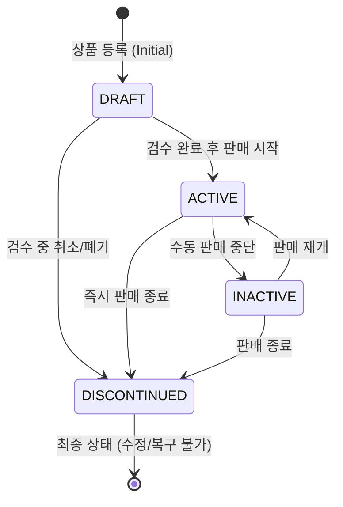
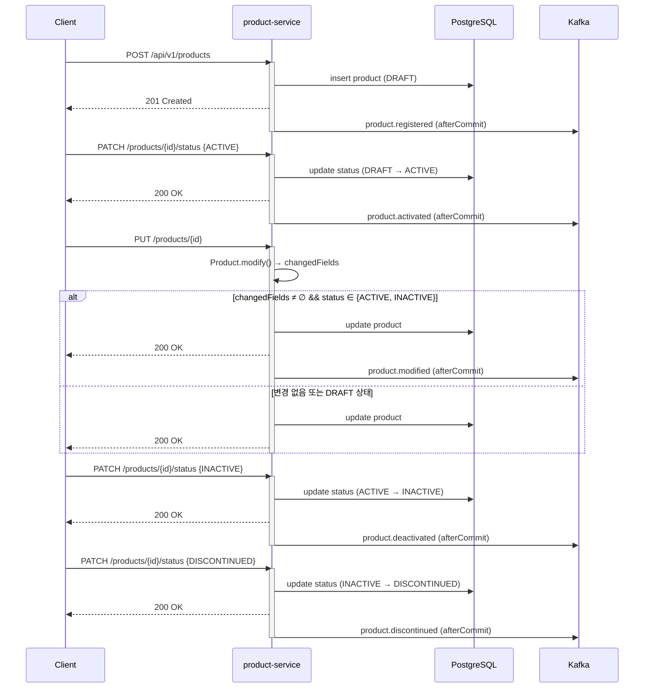

# Product Service

## 1. 개요 (Overview)

`product-service`는 커머스 플랫폼의 상품 카탈로그 및 메타데이터를 관리하는 마이크로서비스입니다. 상품의 등록, 정보 수정, 그리고 판매 가능 여부를 결정하는 생명주기(Lifecycle) 관리를
담당합니다.

---

## 2. 도메인 용어 사전 (Ubiquitous Language)

| 용어                             | 정의                                                         | 비고                                                                                  |
|:-------------------------------|:-----------------------------------------------------------|:------------------------------------------------------------------------------------|
| **Product (상품)**               | 판매의 최소 단위. 이름, 정가·판매가, 통화, 카테고리, 판매 기간, 썸네일, 설명을 속성으로 가짐.  |                                                                                     |
| **ProductStatus (상품 상태)**      | 상품의 노출 및 판매 가능 여부를 결정하는 상태.                                | `DRAFT`, `INACTIVE`, `ACTIVE`, `DISCONTINUED`                                       |
| **ListPrice (정가)**             | 상품의 공식 소비자 가격. 0원 이상이어야 함.                                 | 음수 불가                                                                               |
| **SellingPrice (판매가)**         | 실제 결제되는 가격. 0원 이상이며 `listPrice` 이하여야 함.                    | 할인 적용 결과가 이 값                                                                       |
| **ProductCategory (카테고리)**     | 상품 분류.                                                     | `FIGURE`, `PLUSH`, `MODEL_KIT`, `TRADING_CARD`, `BOARD_GAME`, `DIECAST`, `PUZZLE`, `ACCESSORY`, `ETC` |
| **SalePeriod (판매 기간)**         | 판매 시작/종료 시각(`saleStartAt`, `saleEndAt`). 선택 필드.             | 종료일은 과거일 수 없고, 시작일은 종료일보다 앞서야 함                                                     |
| **Discontinued (판매 종료)**       | 더 이상 판매하지 않으며, 정보 수정 및 재활성화가 불가능한 최종 상태.                    |                                                                                     |

---

## 3. 핵심 비즈니스 규칙 (Core Business Rules)

### 3.1 데이터 정합성 제약

- **필수 정보**: 상품 이름, 정가(`listPrice`), 판매가(`sellingPrice`), 통화(`currency`), 카테고리(`category`), 설명(`description`)은 등록 시 반드시 입력되어야 합니다. (`null` 또는 공백 불가)
- **가격 제약**: `listPrice`와 `sellingPrice`는 각각 **0원 이상**이어야 하며, `sellingPrice`는 `listPrice`보다 클 수 없습니다.
- **판매 기간 제약**: `saleEndAt`은 과거일 수 없고, `saleStartAt`이 지정된 경우 반드시 `saleEndAt`보다 앞서야 합니다. (둘 다 선택 필드)
- **썸네일 URL**: `thumbnailUrl`은 선택 필드이며, 최대 500자까지 허용합니다.

### 3.2 상태 기반 수정 제한

- **수정 불가**: 상품 상태가 **`DISCONTINUED`**인 경우, 상품 이름, 가격 등 모든 기본 정보의 수정을 차단합니다.
- **재활성화 불가**: 한 번 `DISCONTINUED` 상태로 변경된 상품은 다시 `ACTIVE` 또는 `INACTIVE` 상태로 되돌릴 수 없습니다. (영구적 판매 종료)
- **`DRAFT → INACTIVE` 금지**: `INACTIVE`는 "한 번 이상 활성화됐던 상품이 중단된 상태"를 의미하므로, 아직 한 번도 판매되지 않은 `DRAFT` 상태에서는 `INACTIVE`로 바로 전이할 수 없습니다.

---

## 4. 상품 생명주기 및 상태 전이 (State Transition)

상품은 다음과 같은 흐름으로 상태가 변합니다.

1. **DRAFT (임시 저장)**: 최초 등록 시의 기본 상태입니다. 내부 검수 및 판매 준비 중인 단계로, 아직 한 번도 판매된 적이 없는 상품을 의미합니다.
2. **INACTIVE (판매 중단)**: 한 번 이상 활성화됐던 상품의 판매를 일시 중단한 상태입니다. `ACTIVE`에서만 진입할 수 있습니다.
3. **ACTIVE (판매 중)**: 사용자에게 노출되며 실제 주문이 가능한 판매 중 상태입니다.
4. **DISCONTINUED (판매 종료)**: 상품의 판매가 영구적으로 종료된 상태입니다.
    - **핵심 로직**: `DISCONTINUED` 상태는 터미널(Terminal) 상태로, 이 상태에 진입하면 상태 복구가 불가능하며 정보 수정도 제한됩니다.

---

## 5. 주요 유스케이스 (Key Use Cases)

### 상품 등록 (Create)

- 입력: 이름, 정가, 판매가, 통화, 카테고리, 판매 시작/종료(선택), 썸네일 URL(선택), 설명
- 결과: `DRAFT` 상태의 상품 생성 → `product.registered` 이벤트 발행
- 검증: 필수 필드 입력, 정가/판매가 >= 0, 판매가 <= 정가, 판매 기간 유효성

### 상품 정보 수정 (Modify)

- 대상: 이름, 정가, 판매가, 통화, 카테고리, 판매 시작/종료, 썸네일 URL, 설명
- 조건: 현재 상태가 `DISCONTINUED`가 아닐 것
- 결과: 변경된 필드만 집합으로 반환. 현재 상태가 `ACTIVE` 또는 `INACTIVE`이고 변경 필드가 하나라도 있을 때 `product.modified` 이벤트 발행
- 참고: `DRAFT` 상태의 수정은 외부에 노출된 적이 없으므로 이벤트를 발행하지 않음

### 상품 상태 변경 (Change Status)

- 입력: 변경할 목표 상태 (`ProductStatus`)
- 조건: 허용된 전이 규칙(`ProductStatus.canTransitionTo`)을 따라야 함. 현재 상태가 `DISCONTINUED`이면 다른 상태로 전이할 수 없고, `DRAFT`에서는 `INACTIVE`로 직접 전이할 수 없음
- 결과: 상태 값 업데이트 후 전이 결과에 따라 이벤트 발행 (아래 §6 참조)

---

## 6. 발행 이벤트 (Published Events)

모든 이벤트는 트랜잭션 커밋 이후(`TransactionSynchronization#afterCommit`)에 발행되며, 파티션 키는 `productId`다.

| Topic                  | 발행 시점                                       | 페이로드                                 |
|------------------------|---------------------------------------------|--------------------------------------|
| `product.registered`   | 상품 등록(`DRAFT` 생성) 직후                        | `productId`                          |
| `product.activated`    | 상태가 `ACTIVE`로 전이된 시점 (`DRAFT→ACTIVE`, `INACTIVE→ACTIVE`) | 상품 전체 스냅샷 (카탈로그 노출용)                 |
| `product.deactivated`  | 상태가 `INACTIVE`로 전이된 시점 (`ACTIVE→INACTIVE`)  | `productId`                          |
| `product.discontinued` | `ACTIVE` 또는 `INACTIVE`에서 `DISCONTINUED`로 전이된 시점 | `productId`                          |
| `product.modified`     | `ACTIVE`/`INACTIVE` 상태 상품의 필드가 실제로 변경된 경우   | 변경 후 상품 전체 스냅샷                       |

**발행되지 않는 경우:**

- `DRAFT → DISCONTINUED`: 공개된 적 없는 상품의 폐기이므로 `product.discontinued`를 발행하지 않음
- 동일 상태로의 전이(`ACTIVE → ACTIVE` 등): 상태가 실제로 바뀌지 않았으므로 미발행
- `DRAFT` 상태 상품의 정보 수정: 외부에 노출된 적이 없어 `product.modified` 미발행
- `ModifyProduct` 호출 시 실제 변경된 필드가 없는 경우: `product.modified` 미발행

### 상태 전이 및 이벤트 발행 시퀀스

