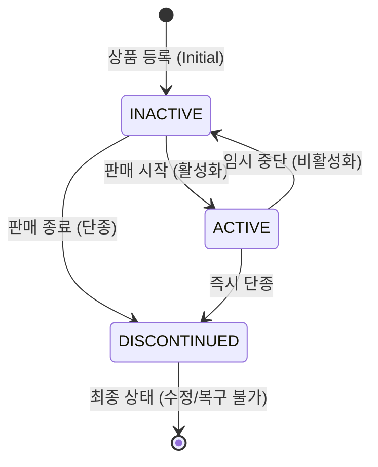

# Product Service

## 1. 개요 (Overview)

`product-service`는 커머스 플랫폼의 상품 카탈로그 및 메타데이터를 관리하는 마이크로서비스입니다. 상품의 등록, 정보 수정, 그리고 판매 가능 여부를 결정하는 생명주기(Lifecycle) 관리를
담당합니다.

---

## 2. 도메인 용어 사전 (Ubiquitous Language)

| 용어                        | 정의                                       | 비고                                   |
|:--------------------------|:-----------------------------------------|:-------------------------------------|
| **Product (상품)**          | 판매의 최소 단위. 이름, 가격, 통화, 설명 정보를 가짐.        |                                      |
| **ProductStatus (상품 상태)** | 상품의 노출 및 판매 가능 여부를 결정하는 상태.              | `INACTIVE`, `ACTIVE`, `DISCONTINUED` |
| **Price (가격)**            | 상품의 판매 금액. 0원 이상이어야 함.                   | 음수 불가                                |
| **Discontinued (단종)**     | 더 이상 판매하지 않으며, 정보 수정 및 재활성화가 불가능한 최종 상태. |                                      |

---

## 3. 핵심 비즈니스 규칙 (Core Business Rules)

### 3.1 데이터 정합성 제약

- **필수 정보**: 상품 이름, 가격, 통화(Currency), 설명은 등록 시 반드시 입력되어야 합니다. (`null` 또는 공백 불가)
- **가격 제약**: 모든 상품의 가격(`price`)은 **0원 이상**이어야 합니다. (0원 포함, 음수 불가)

### 3.2 상태 기반 수정 제한

- **수정 불가**: 상품 상태가 **`DISCONTINUED`**인 경우, 상품 이름, 가격 등 모든 기본 정보의 수정을 차단합니다.
- **재활성화 불가**: 한 번 `DISCONTINUED` 상태로 변경된 상품은 다시 `ACTIVE` 또는 `INACTIVE` 상태로 되돌릴 수 없습니다. (영구적 단종)

---

## 4. 상품 생명주기 및 상태 전이 (State Transition)

상품은 다음과 같은 흐름으로 상태가 변합니다.

1. **INACTIVE (비활성화)**: 최초 등록 시의 기본 상태입니다. 내부 검수 중이거나 일시적으로 판매를 중단할 때 사용합니다.
2. **ACTIVE (활성화)**: 사용자에게 노출되며 실제 주문이 가능한 판매 중 상태입니다.
3. **DISCONTINUED (단종)**: 상품의 판매가 영구적으로 종료된 상태입니다.
    - **핵심 로직**: `DISCONTINUED` 상태는 터미널(Terminal) 상태로, 이 상태에 진입하면 상태 복구가 불가능하며 정보 수정도 제한됩니다.

---

## 5. 주요 유스케이스 (Key Use Cases)

### 상품 등록 (Create)

- 입력: 이름, 가격, 통화, 설명
- 결과: `INACTIVE` 상태의 상품 생성
- 검증: 모든 필드 필수 입력, 가격 >= 0

### 상품 정보 수정 (Modify)

- 대상: 이름, 가격, 통화, 설명
- 조건: 현재 상태가 `DISCONTINUED`가 아닐 것
- 결과: 상품 메타데이터 업데이트

### 상품 상태 변경 (Change Status)

- 입력: 변경할 목표 상태 (`ProductStatus`)
- 조건: 현재 상태가 `DISCONTINUED`인 경우 다른 상태로의 변경 차단
- 결과: 상태 값 업데이트
